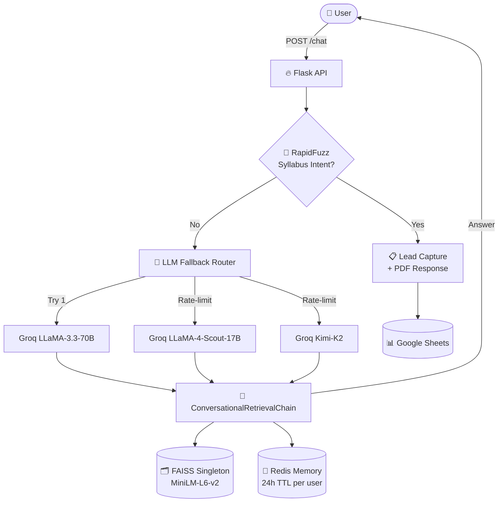

# 💬 Smatal Academy AI Chatbot — Backend

> A production-grade institutional chatbot backend serving **Smatal Academy** admissions queries — built on **Flask + LangChain** with a **FAISS-based RAG pipeline**, **3-tier Groq LLM fallback**, **Redis-backed per-user memory**, and a **dual-role prompt** (Administrator / Consultant) that adapts behaviour to the user's intent.

Deployed to **Zoho Catalyst Cloud** via Docker + Gunicorn.

---

## ✨ Features

- 🧠 **RAG pipeline** powered by FAISS + HuggingFace Inference Embeddings (MiniLM-L6-v2)
- 🔄 **3-tier LLM fallback** — automatically degrades from LLaMA-3.3-70B → LLaMA-4-Scout-17B → Kimi-K2 on rate-limit errors
- ⚡ **Singleton retriever pattern** — loads the FAISS vector store **once** at startup instead of per request
- 🧵 **Multi-user session management** with Redis-backed conversation memory (24-hour TTL)
- 🎯 **Hybrid intent detection** — `RapidFuzz` pre-filter for syllabus requests, LLM for everything else
- 🎭 **Dual-role prompt** — switches between Administrator mode (factual answers) and Consultant mode (career guidance) based on query type
- 📄 **Lead capture pipeline** — collects user details → Google Sheets → returns syllabus PDF
- 🐳 **Docker-ready** with `docker-compose.yaml` for local development

---

## 🏗 Architecture



---

## 🛠 Tech Stack

| Layer | Technology |
|-------|-----------|
| **Web Framework** | Flask + Flask-CORS |
| **LLM Orchestration** | LangChain (`ConversationalRetrievalChain`) |
| **LLM Provider** | Groq (LLaMA-3.3-70B / LLaMA-4-Scout-17B / Kimi-K2) |
| **Vector Store** | FAISS (local, CPU build) |
| **Embeddings** | HuggingFace Inference API (`sentence-transformers/all-MiniLM-L6-v2`) |
| **Session Memory** | Redis (24-hour TTL) |
| **Intent Detection** | RapidFuzz (fuzzy partial-ratio matching) |
| **Lead Capture** | Google Sheets API (`gspread` + `oauth2client`) |
| **Server** | Gunicorn |
| **Deployment** | Zoho Catalyst Cloud (Docker) |

---

## 📂 Project Structure

```
Backend/
├── main.py                      # Flask app + routes
├── langchain_helper.py          # RAG chain builder + dual-role prompt
├── llm_router.py                # 3-tier LLM fallback with cooldown locks
├── singleton_retriver.py        # Singleton pattern for FAISS retriever
├── hf_api_embedding.py          # HuggingFace Inference API embeddings
├── redis_cache.py               # Per-user memory persistence with TTL
├── Syllabus_fuzz_detection.py   # RapidFuzz-based intent classifier
├── Syllabus_keywords.py         # Keyword lists for fuzzy matching
├── course_details.py            # Course → PDF mapping
├── google_sheet.py              # Lead capture to Google Sheets
├── Samtal-Data-Vector/          # Pre-built FAISS index
├── Dockerfile
├── docker-compose.yaml
├── catalyst.json                # Zoho Catalyst deployment config
└── requirements.txt
```

---

## 🚀 Getting Started

### Prerequisites

- Python **3.10+**
- Redis instance (local or hosted)
- HuggingFace API token
- Groq API key
- Google Service Account JSON (for Sheets integration)

### 1. Clone and install

```bash
git clone https://github.com/muhammadhamthan/Smatal-Institude.git
cd Smatal-Institude/Backend
python -m venv env
source env/bin/activate          # Windows: env\Scripts\activate
pip install -r requirements.txt
```

### 2. Configure environment variables

Create a `.env` file:

```bash
GROQ_API_KEY=your_groq_key
HF_TOKEN=your_huggingface_token
REDIS_URL=redis://localhost:6379
```

Place your Google Service Account JSON as `credentials.json`.

### 3. Run locally

```bash
python main.py                   # Dev mode on port 8080
```

Or with Gunicorn:

```bash
gunicorn -w 4 -b 0.0.0.0:8080 main:app
```

### 4. Run with Docker

```bash
docker-compose up --build
```

---

## 📡 API Endpoints

| Method | Endpoint | Purpose |
|--------|----------|---------|
| `GET` | `/` | Health check |
| `POST` | `/chat` | Main chat endpoint (accepts `message`, `user_id`) |
| `POST` | `/refresh` | Clear a user's conversation memory |
| `POST` | `/submit_details` | Capture lead → Google Sheets → return syllabus PDF |

### Example request

```bash
curl -X POST http://localhost:8080/chat \
  -H "Content-Type: application/json" \
  -d '{"user_id": "u123", "message": "What courses do you offer?"}'
```

---

## 🔬 How It Works

1. **Request arrives** at `POST /chat` with `user_id` and `message`.
2. **RapidFuzz** checks if this is a syllabus request — if yes, short-circuit to the lead-capture flow.
3. **Redis** is queried for prior conversation memory for this user.
4. The **singleton FAISS retriever** fetches the most relevant document chunks.
5. The **LLM router** picks the first non-rate-limited model from a 3-tier list.
6. **LangChain `ConversationalRetrievalChain`** composes the prompt with context + chat history + the user question.
7. The **dual-role system prompt** instructs the LLM to act as an *Administrator* (factual) or *Consultant* (advisory) based on the query.
8. The response is returned to the user, and the updated memory is persisted back to Redis.

---

## 🛡 Reliability Engineering

| Concern | Solution |
|---------|----------|
| **Rate limits** | Multi-tier model fallback with per-model cooldown (1 hour) protected by a thread-safe lock |
| **Cold start** | Singleton retriever loads FAISS once at app boot, not per request |
| **Memory bloat** | Redis TTL of 24 hours per user — sessions expire automatically |
| **Cost control** | Pre-LLM fuzzy intent check resolves common syllabus queries without calling the model |
| **Multi-user safety** | Per-user Redis keys (`user_chat_memory:{user_id}`) prevent cross-talk |

---

## 🔮 Future Improvements

- 📊 Observability: Prometheus metrics for LLM latency, fallback triggers, retrieval hits
- 🧪 Evaluation harness for prompt regressions
- 🌐 Multilingual support (Tamil, Hindi)
- 🔍 Hybrid search (BM25 + dense) for better retrieval recall
- 🎙 Voice input support

---

## 📝 License

MIT

---

## 👤 Author

**Muhammad Hamthan** — [GitHub](https://github.com/muhammadhamthan) • [LinkedIn](https://linkedin.com/in/muhammadhamthan)
